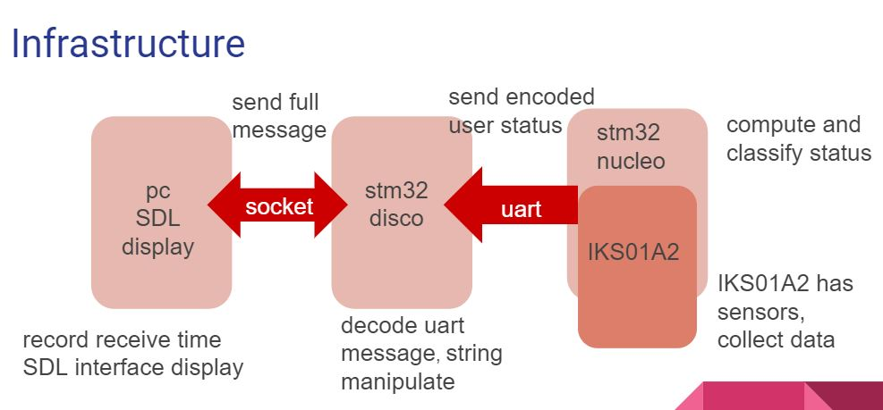

# Intelligent Motion Recorder

**Author:**
> Yi-Hui Chou B06901012,
> Luo-Yun Rong B06901073

**Department:**
> 3rd year, Electrical Engineering Department, National Taiwan University

**Advisor:**
> Professor Sheng-De Wang

## Content
- [Overview](#overview)
- [Motivation](#motivation)
- [Implementation](#implementation)
    + [Function](#function)
    + [Infrastructure](#infrastructure)
- [Achievement](#achievement)
- [How to reproduce](#how-to-reproduce)

## Overview
- A motion Recorder for day and night
- Implement on STM32L475 and STM32L476+IKS01A2
- Use wifi and uart to transmit data

## Motivation
Wearable devices are everywhere, so we want to create an  intelligent wearable to record a person's activity, including moving, sleeping, exercising, and so on, so as to manage his or her health.

## Implementation
### Function
We implemented two modes in this project, day mode and night mode.
- Day mode
> Update motion detection, with 8 motions in total (stationary, standing, sitting, lying, walking,          fast walking, jogging, biking)
- Night mode
> If the user is asleep, detect his or her turnover during his or her sleep.

> If the user is not asleep, detect the user's activity, which is same with Day mode.

### Infrastructure

1. STM32l476 nucleo + IKS01A2
> There are many sensors in IKS01A2.  In this project, LSM6DSL accelerometer and LPS22HB pressure sensor are used.  IKS01A2  collects data, and nucleo does the calculation and analyze a user's status.

2. STM32l475 disco
> Use UART4 port to receive messages from nucleo, and decode them.  Afterwards, disco would send messages to PC server using socket.

3. PC server
> Upon receiving messages from disco, PC server would record the time and the message to a log file, and display the result on screen using SDL library.
   

## Achievement
- Day mode
> We successfully detect motions like stationary, walking, fast walking, jogging, sitting.  Moreover, it goes smoothly when pressing a button to switch mode. 

- Night mode
> We successfully detect motions when a user is not asleep and we also detect turn over immediately.  Moreover, when STM32 nucleo is stationary for more than 6 minutes, the status turns from no sleeping to lying and then to sleeping, which pretty makes sense.

**[demo video link](https://drive.google.com/open?id=1mKJFM953Cb-rhk2k8j25r6vZ5kqS9A22)**

## How to reproduce
 1. clone all the repo
 2. go to SDL official website to download SDL library
 3. compile display.cpp `g++ display.cpp -lSDL2 -o display | tee logfile`
 4. In terminal, execute ./display, and click start to start listening
